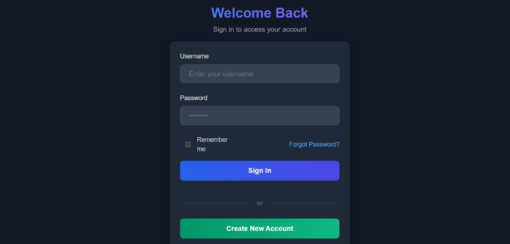
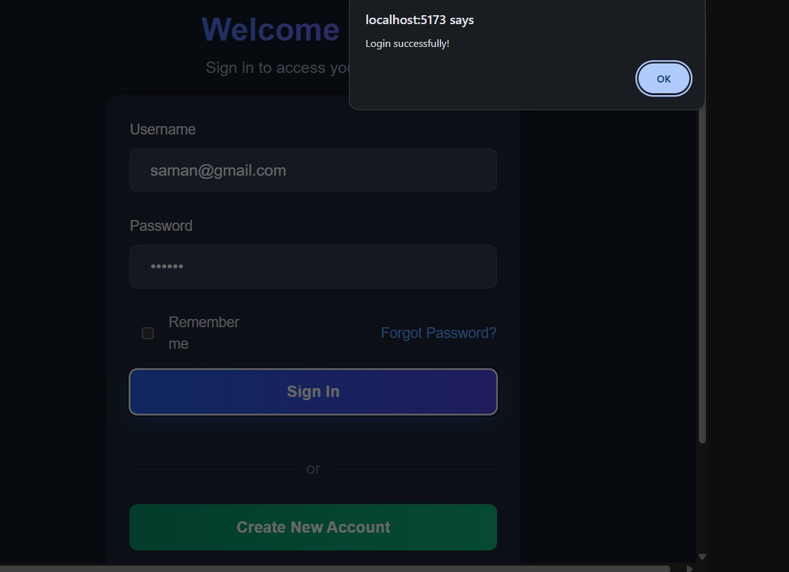
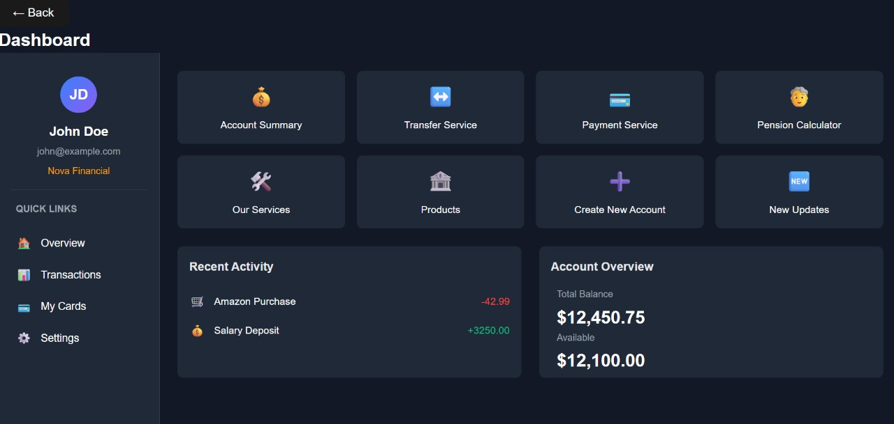

# E-Banking Platform

https://github.com/shanika200721/E-Pass-Book/Demovideo.mp4
 
 
 

A modern online banking web application with secure authentication, account management, and transaction features.

## Features

- **User Authentication**
  - Secure login/registration
  - Password recovery
- **Account Dashboard**
  - Overview of all accounts
  - Quick access to common actions
- **Transaction Management**
  - View transaction history
  - Filter and search transactions
- **Account Services**
  - Transfer between accounts
  - Payment services
  - Account creation
 
  - 
   

## Technologies Used

### Frontend
- React.js
- React Router
- CSS Modules
- Axios (for API calls)

### Backend
- Node.js
- Express.js
- MongoDB (with Mongoose)
- JWT Authentication

## Installation

### Prerequisites
- Node.js (v14 or higher)
- MongoDB (v4.4 or higher)
- npm or yarn

## Screens
- Welcome Screen - Landing page with login option
- Login/Register - User authentication forms
- Dashboard - Account overview and quick actions
- Account Summary - Detailed view of all accounts
- Transactions - Transaction history for each account

## Future Enhancements
- Implement fund transfer functionality
- Add bill payment services
- Integrate mobile banking features
- Add account statement export
- Implement two-factor authentication
